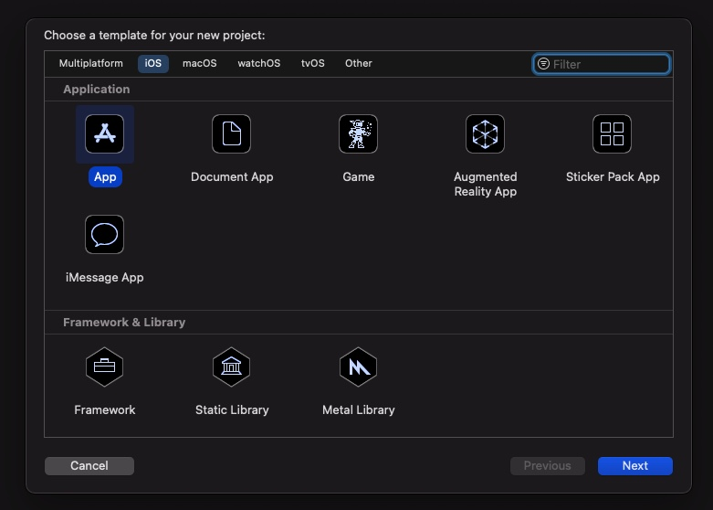
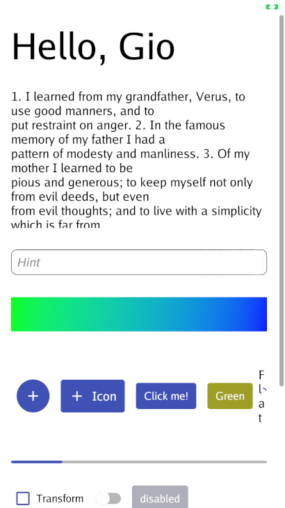

# GIO iOS app install tutorial

Christophe Meessen – 12 Jul 2021

In this short tutorial, I will explain how to run a GIO application on an iOS mobile devices without any Apple developer license. The apps must be built on a Mac computer. It is possible to test iOS apps on the iPhone, iPod or iPad, but the app will automatically disable itself after 6 days. To create persistent apps, one needs an Apple developer license (https://developer.apple.com/programs/).

Developing and testing apps without a license allows to experiment with GIO on mobile platform and delay payment once the app is ready to be commercialized. 

GIO provides some directives to build mobile apps here (https://gioui.org/doc/mobile). For iOS development, the Xcode developing environment is required. It can be downloaded from the Apple store on a Mac.  

## Xcode

The tutorial is based on Xcode 12.5.1. The version of iOS of my iPhone and iPad was 14.6 when I made this tutorial. Unfortunately, Xcode 12.5.1 can’t build for iOS 14.6 because this version of Xcode was released just before the release of iOS 14.6. But there is a small trick to get around this problem. 

Open the application content. Using the finder open the application folder. Click on control and select the popup menu command “display the package content”. Go into Xcode > Contents > Developer > Platforms > iPhoneOS.plateform > DeviceSupport. Copy the directory 14.5 and rename the copy 14.6.  This will make it possible to build apps for the iOS version 14.6. It’s a hack that might not be needed anymore when you read this tutorial. 

# Hello world app

The first step is to build the hello world example and run it in the simulator. 

Launch Xcode and you will see a modal dialog inviting you to pick what you want to do. 


You have to pick “Create a new Xcode project”.  Then another dialog opens and ask you what type of platform and app type. Pick iOS and App which are highlighted in the screen capture below, then click on next at the bottom right of the dialog.





This displays you the following dialog.


You have to specify the product name, the team and the organization identifier.  For the product name we’ll use test or you can use helloWorld if you prefer. 

You then have to identify your team.  The procedure is explained here (https://9to5mac.com/2016/03/27/how-to-create-free-apple-developer-account-sideload-apps/). You have to connect to the developer.apple.com account and check some legal document and specify if you work a sole developer or in a larger team. You should pick sole developer. Don’t worry. It’s free. 

Once you have done that, you have to go in the Xcode > Preferences > Accounts menu of Xcode. Click on the thin + in the bottom right of the left panel to add an AppleID. Select AppleId as account to add and click continue. You well have to provide your Apple ID and authentify. 

After that you should be able to pick yourself as the team in all you new projects. 

You then have to provide the organization identifier. It is a string that should be unique. A good practice is to pick a domain name you own and write it with the tld first as in the screen capture above. 

The application id will be “net.meessen.Test”. It is the concatenation of the organization identifier and the application name. Beware that you can’t reuse the same app identifier for another app. They are unique.  Leave the interface, Life Cycle and Language fields unmodified. 

The next screen is to create the project directory. Create a Test directory and click the button create. 

Once the project is created, you’ll see the open project. The default app is a Hello World app. 


You should connect your iOS device at this stage. I had some problems with this step for unknown reason. The phone kept connecting and disconnecting. I don’t remember how, but I finally managed to connect the phone. 

The next step is to select the menu command Product > Destination > iOS Device (your device). 


My device is named Corrida. 

The execute the command Product > Run. This should build the project, ask your password to sign the program and upload the program on the iOS device. 


You’re not done yet. It will display a warning if you launch the app. You need to tell your iOS device that you trust this developer application. 

To do so you have to go in Parameters > General > Device management > Apple Development.

You then select the Test program and you acknowledge that you trust it. Then you can run the app. The result is shown below. 

If you made it up to here, congratulation. You made an iOS app in swift. This app will be valid only 6 days. It won’t work anymore after that.

The next section explain how to build a GIO app.


## Building, installing and running a GIO app

To build a GIO app you create a new project whose name is the one on the GIO app. 

Let say Kitchen. 

But instead of selecting the device and running the app, you simply build the app. This will ask for your password to sign some certificate I guess. 


That is all you have to do with the Xcode program. What is important to know is that the app Id is the organization identifier followed by the product name. In my example the organization name is net.meessen and the Product name is now Kitchen. The app id will then be “net.meessen.Kitchen”.

To build the GIO program and the ipa to upload to the device, you need to open a shell. In this shell you execute the following commands:

```bash
mkdir kitchen
cd kitchen
go mod init
go get gioui.org/cmd/gogio@latest
go get gioui.org/example/kitchen
go run gioui.org/cmd/gogio -target ios -appid net.meessen.Kitchen gioui.org/example/kitchen
```

Here he may complain of a missing go.sum file and will display the go get command with the specific version to get. You then reissue the go run command, it’ll ask for your password and the magic operates. 

If you type ls -l, you should see the file kitchen.ipa which is the file to upload to the device. To do so, the most simple is to use the “ideviceinstaller” command line that you can get with brew install. Use the command “brew install ideviceinstaller” to install it. 

Once installed, and with your device connected, you can upload the program to the iOS device. 

```bash
$ ideviceinstaller -i kitchen.ipa 
WARNING: could not locate iTunesMetadata.plist in archive!
WARNING: could not locate Payload/Kitchen.app/SC_Info/Kitchen.sinf in archive!
Copying 'kitchen.ipa' to device... DONE.
Installing 'net.meessen.Test'
Install: CreatingStagingDirectory (5%)
Install: ExtractingPackage (15%)
Install: InspectingPackage (20%)
Install: TakingInstallLock (20%)
Install: PreflightingApplication (30%)
Install: InstallingEmbeddedProfile (30%)
Install: VerifyingApplication (40%)
Install: CreatingContainer (50%)
Install: InstallingApplication (60%)
Install: PostflightingApplication (70%)
Install: SandboxingApplication (80%)
Install: GeneratingApplicationMap (90%)
Install: Complete
$ 
```

You can then look at your device. You may have to trust the app by acknowledge it in the parameters > general > device management > Apple Development. I didn’t have to with my tests. 

Once done, you can run the app and admire the kitchen example on you iOS device. 

As can be seen, the text is perfectly rendered. Thanx to the retina HiDPI display. 

The following screen capture is from my iPhone.



